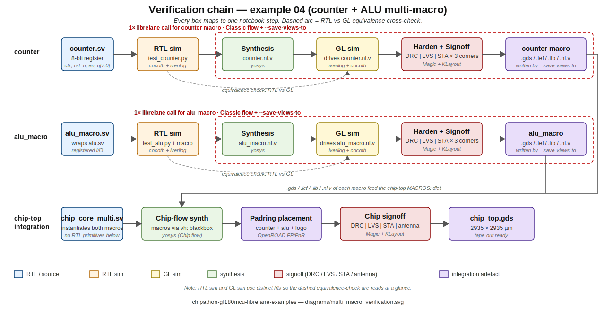

# LibreLane RTL-to-GDS path on GF180MCU

Five hands-on Jupyter notebooks that take a chipathon-2026 participant from "I have a tiny piece of Verilog" to "I have a fab-ready GDSII that respects the workshop padring." Everything runs inside the `hpretl/iic-osic-tools:chipathon26` Docker image; no Nix install required.

This is the **automated digital RTL-to-GDS path** for chipathon-2026. It complements [`examples/analog_tutorial/`](../analog_tutorial/) (the Xschem + ngspice + KLayout analog flow already on `main`). Use this folder when you want **synthesis + place-and-route + signoff** driven by [LibreLane](https://github.com/librelane/librelane).

> **Docker tag.** These notebooks were validated against `hpretl/iic-osic-tools:chipathon26` (LibreLane v3.0.2). The older `:chipathon` tag does **not** ship LibreLane and will not run these flows. The bootstrap script in `scripts/bootstrap_container.sh` defaults to `:chipathon26`; override with `IIC_IMAGE=hpretl/iic-osic-tools:next` if you need the upstream rolling tag.


The host/container model is the same for every example: notebooks live on the host, the EDA tools run inside a `gf180` container, and `~/eda/designs <-> /foss/designs` is the bind-mount that lets both sides see the same files.


## Reading order

| # | Notebook | Runtime | Status |
|---|----------|---------|--------|
| 00 | [00_slots_explained.ipynb](00_slots_explained.ipynb) | 2 min, read-only | validated |
| 01 | [01_rtl2gds_counter.ipynb](01_rtl2gds_counter.ipynb) | 1-2 min flow | validated, all signoff = 0 |
| 02 | [02_rtl2gds_chip_top_custom.ipynb](02_rtl2gds_chip_top_custom.ipynb) | ~80 min | Magic-DRC clean; chip-top LVS quirk on the wafer-space template (see notebook) |
| 03 | [03_rtl2gds_chipathon_use.ipynb](03_rtl2gds_chipathon_use.ipynb) | 35-45 min | validated, all signoff = 0 |
| 04 | [04_counter_alu_multimacro/](04_counter_alu_multimacro/) | ~60-90 min chip-top + ~5 min macros + cocotb | validated end-to-end, all signoff = 0 |

All notebooks default their `RUN_*` flags to `False`, so the first pass through every cell only **prints** the commands it would run. Flip each flag once you are ready to commit to the (sometimes hours-long) step.

## Quickstart

```bash
# 1. Bootstrap the container (one-time, ~18 GB pull on first run).
scripts/bootstrap_container.sh

# 2. Sanity-check the environment.
scripts/verify_prereqs.sh

# 3. Open the notebooks.
jupyter lab 00_slots_explained.ipynb
```

The workshop padring used by notebooks 00, 03, and 04 is in [`../../resources/Integration/workshop_padring_librelane/`](../../resources/Integration/workshop_padring_librelane/). It is a vendored copy of the [`Mauricio-xx/chipathon-2026-gf180mcu-padring`](https://github.com/Mauricio-xx/chipathon-2026-gf180mcu-padring) fork (which itself ports Juan Moya's pad layout to a LibreLane slot). See [`docs/container_setup.md`](docs/container_setup.md) for the full bootstrap flow.

---

## 00 — Slots explained

[`00_slots_explained.ipynb`](00_slots_explained.ipynb)

Read-only walkthrough of what a "slot" is in the chipathon padring template. A slot is **three files** — a Verilog top, a `slot_defines.svh` macro file that lists the pads, and a config that ties them to LibreLane.


The chipathon-2026 workshop pad map looks like this — 24 pads on the perimeter, with reset / clock / scan-test / SPI / GPIO grouped on each side:


**What you learn:** the anatomy of a slot, what files you actually need to touch when you swap your `chip_core` in, and what the padring expects on each pin. No flow runs here — purely conceptual setup before example 01.

---

## 01 — Bare counter through the Classic flow

[`01_rtl2gds_counter.ipynb`](01_rtl2gds_counter.ipynb)

Smoke test. A 4-bit counter is hardened **standalone** (no padring, no chip-top) through the LibreLane **Classic** flow. RTL is inlined in the notebook; LibreLane config is inlined in the notebook. One container `docker exec` runs the whole flow in 1-2 minutes and produces a complete `runs/<timestamp>/` with `final/metrics.csv`.

This is the example you run first to confirm your container, your bind-mount, and your LibreLane install are all wired up correctly. If 01 fails, nothing downstream will work.

**What you learn:** how `librelane` is invoked inside the container, what a Classic-flow run looks like, and how to read `final/metrics.csv` to confirm signoff metrics are zero.

---

## 02 — Custom chip-top against the upstream wafer-space slot

[`02_rtl2gds_chip_top_custom.ipynb`](02_rtl2gds_chip_top_custom.ipynb)

Full **Chip** flow on the stock `slot_1x1` from the [wafer-space](https://github.com/wafer-space/gf180mcu-project-template) template (i.e., **not** the chipathon-2026 fork yet). The counter from example 01 is hardened separately as a macro and dropped in as a pre-characterised block, replacing one of the SRAM instances in the original template.

This teaches the **hierarchical macro path**: how a `.gds + .lef + .lib + .v` quartet for a hand-hardened block plugs into a chip-top run via the `MACROS:` dict and `PDN_MACRO_CONNECTIONS:` lines.

**Status / known caveat.** The flow goes Magic-DRC clean (the authoritative DRC for gf180mcuD) and 76 of 77 steps complete. **Chip-top LVS** has a known port-extraction quirk on the wafer-space `slot_1x1` template — `VDD` is missing from the top-level port list while `VSS` is present, so Netgen flags a one-port mismatch even though IR-drop confirms `VDD` is propagating across the die. The notebook documents this in its intro callout. **For a fully-clean signoff path that includes LVS use example 04**, which uses the chipathon-2026 padring and has the same macro pattern working end-to-end.

KLayout DRC is intentionally disabled in this example: gf180mcuD ships no curated KLayout runset and the open-source rules can take 1+ hours on a chip-top design. Magic DRC is authoritative.

**Runtime:** ~80 min on the validated host. Set `timeout=None` in the `subprocess.run(...)` call so a long flow does not get killed mid-run; abort instead by stopping the kernel.

---

## 03 — Your own chip_core through the chipathon padring

[`03_rtl2gds_chipathon_use.ipynb`](03_rtl2gds_chipathon_use.ipynb)

**The notebook you mostly live in during chipathon-2026.** Stages the workshop padring template into `~/eda/designs/chipathon_padring/template`, drops your own `chip_core.sv` into `src/`, and runs `SLOT=workshop make librelane` against the full Chip flow.

This is where the workshop pad map (shown in example 00) actually becomes a layout. The same diagram applies — your `chip_core` sits in the middle, the padring is fixed, and your job is to make the two compatible.

The pad list in `slot_defines.svh` (which example 00 walked you through) tells you exactly which signals the padring expects on the core boundary. `chip_core` ports must match it.

**What you learn:** how the workshop slot is wired up, how `SLOT=workshop` parameterises the build, and how the padring constrains your top-level interface. Validated 35-45 min runtime, all signoff metrics zero.

---

## 04 — Two macros stitched into the workshop slot

[`04_counter_alu_multimacro/`](04_counter_alu_multimacro/)

Two macros — an 8-bit counter and a 4-bit ALU wrapped in a registered macro — are hardened **independently** in the Classic flow, then **stitched together** inside the chipathon-2026 workshop slot. This is the example to study if you are planning a real submission with more than one user block.


The verification chain is the most thorough of any example in this folder: each macro is exercised at RTL with cocotb **and** re-simulated post-synthesis at the gate level against the actual `.nl.v` netlists, before either macro is allowed near the chip-top run.



**What you learn:** how to author `MACROS:` and `PDN_MACRO_CONNECTIONS:` for **multiple** instances, how manual floorplan placement (`location:` + `orientation:`) interacts with the workshop padring, how to write a single cocotb testbench that runs untouched against both RTL and post-synth gate-level, and the patches the notebook applies to the fork's `librelane/config.yaml` so the macros land in the right place.

This is the validated **fully-clean signoff** path: ~84 631 instances at chip-top, all four signoff metrics (Magic DRC, KLayout DRC, Netgen LVS, OpenROAD STA) zero on attempt 1, end-to-end 2 h 13 m.

**See [`04_counter_alu_multimacro/README.md`](04_counter_alu_multimacro/README.md)** for the full file tree, RTL summary, and step-by-step walkthrough.

---

## What to do if a flow misbehaves

- **Step 1 — read the log, not the notebook.** LibreLane writes a top-level `<run>/resolved.json` with the exact resolved config and per-step logs under `<run>/<NN>-<step>/`. The notebook only orchestrates `docker exec` calls; the truth is in the run dir.
- **Step 2 — Magic DRC is authoritative on gf180mcuD.** Don't chase a KLayout DRC failure unless you have a curated runset; the open-source rules disagree with foundry intent in places.
- **Step 3 — for LVS mismatches**, check `<run>/<NN>-netgen-lvs/lvs.report` first. Port-list mismatches at chip-top usually trace back to how Magic extracts boundary labels (see the example 02 caveat above).
- See [`docs/troubleshooting.md`](docs/troubleshooting.md) for the full diagnostic checklist.

## Attribution

Apache-2.0. See [`CREDITS.md`](CREDITS.md) in this folder for per-artifact credits (wafer-space, Juan Moya, IIC-JKU, Mauricio Montanares).
