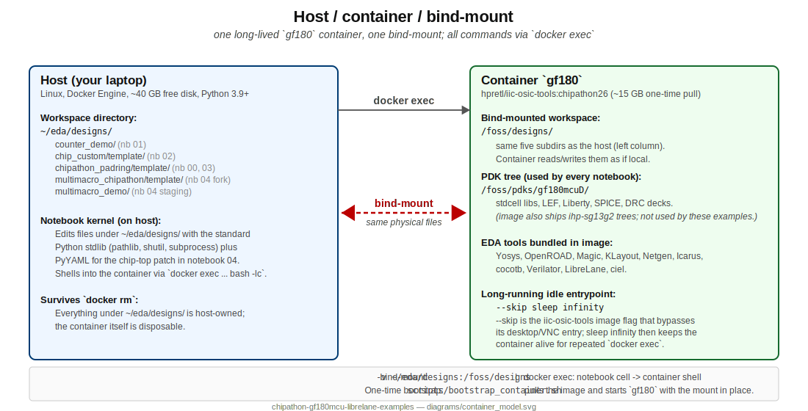

# Container setup

Every example in this repo assumes one long-lived Docker container
called `gf180`, running the `hpretl/iic-osic-tools:next` image, with
the host workspace `~/eda/designs` bind-mounted inside the container
at `/foss/designs`. This document shows how to get there and how to
troubleshoot the common failure modes.

## TL;DR

```bash
scripts/bootstrap_container.sh   # pull + start `gf180`
scripts/verify_prereqs.sh        # sanity check
```

After that, open any notebook under `examples/` and go.

## What the bootstrap script does

```bash
# 1. Pull the image (~15 GB, one-time)
docker pull hpretl/iic-osic-tools:next

# 2. Make sure the host workspace exists.
mkdir -p ~/eda/designs

# 3. Start a long-running container with the bind-mount.
docker run -d --name gf180 \
    -v ~/eda/designs:/foss/designs:rw \
    --user $(id -u):$(id -g) \
    hpretl/iic-osic-tools:next \
    --skip sleep infinity
```

Details:

- `--name gf180` is the canonical handle every notebook uses.
- `--user $(id -u):$(id -g)` keeps artifacts written inside the
  container owned by you on the host. Without this flag, the GDS and
  log files come out as `root:root` and you need `sudo` to delete
  them.
- `--skip sleep infinity` is the image's "stay alive, do nothing"
  idle entrypoint. We then `docker exec` for every actual command.
- The bind-mount is what lets your host's `~/eda/designs` survive
  `docker rm gf180`. Everything outside that path inside the
  container is disposable.



## Running commands inside the container

Every notebook does this under the hood:

```bash
docker exec gf180 bash -lc '<script>'
```

`bash -lc` gives us a login shell so the container's `PATH`,
`PDK_ROOT`, etc. are set up.

Some common one-shots you might type directly:

```bash
# Start an interactive shell inside the container.
docker exec -it gf180 bash

# List PDKs the image ships.
docker exec gf180 bash -lc 'ls /foss/pdks'

# Activate the GF180MCU stdcell library for a one-liner.
docker exec gf180 bash -lc '
    source sak-pdk-script.sh gf180mcuD gf180mcu_fd_sc_mcu7t5v0
    librelane --version
'
```

## Stopping / removing

```bash
docker stop gf180            # stops but keeps the container (and any state in /tmp inside)
docker rm gf180              # removes the container entirely
docker image rm hpretl/iic-osic-tools:next   # reclaim ~15 GB
```

Host artifacts under `~/eda/designs` survive all of the above.

## Troubleshooting

**`docker: command not found`** - install Docker Engine and make sure
your user is in the `docker` group. You should be able to run
`docker ps` without `sudo`.

**`Error response from daemon: Conflict. The container name "/gf180"
is already in use`** - a container with that name already exists. Two
options:

- Reuse it (your notebooks will find it). Run `docker start gf180` if
  it is stopped.
- Remove it: `docker stop gf180 && docker rm gf180`, then
  re-run the bootstrap script.

**`LibreLane exits non-zero on a PDK glob`** - the container's
default PDK is IHP-SG13G2, not GF180. Every notebook sources
`sak-pdk-script.sh gf180mcuD gf180mcu_fd_sc_mcu7t5v0` before invoking
LibreLane. If you drive LibreLane yourself, do the same, plus set
`--pdk-root` to the wafer-space fork when the flow touches padring
I/O cells (notebooks 02, 03, 04).

**`sak-pdk-script.sh: command not found`** - you are inside a different
image than `hpretl/iic-osic-tools:next`. That helper ships with the
image; if it is missing you are not in the right container.

**Render PNG blank** - headless KLayout PNG export sometimes fights
with Qt. Open the GDS on the host instead:

```bash
klayout ~/eda/designs/chipathon_padring/template/final/gds/chip_top.gds
```

**Out of disk** - runs can easily take 10-20 GB each. Clean old
ones:

```bash
rm -rf ~/eda/designs/*/runs         # nukes LibreLane runs across projects
rm -rf ~/eda/designs/*/final        # idem for final/ dirs
```

## Bind-mount paths used by the notebooks

| What | Host path | Container path |
|------|-----------|----------------|
| Workspace root | `~/eda/designs` | `/foss/designs` |
| Counter demo (nb 01) | `~/eda/designs/counter_demo/` | `/foss/designs/counter_demo/` |
| chip_top_custom (nb 02) | `~/eda/designs/chip_custom/template/` | `/foss/designs/chip_custom/template/` |
| Padring fork (nb 00/03 baseline) | `~/eda/designs/chipathon_padring/template/` | `/foss/designs/chipathon_padring/template/` |
| Padring fork copy (nb 04 only)   | `~/eda/designs/multimacro_chipathon/template/` | `/foss/designs/multimacro_chipathon/template/` |
| Multi-macro staging (nb 04)      | `~/eda/designs/multimacro_demo/` | `/foss/designs/multimacro_demo/` |
| Experimental T01 (TUI agent)     | `~/eda/designs/eda_agents_counter_tui/`         | `/foss/designs/eda_agents_counter_tui/` |
| Experimental T02 (Python API)    | `~/eda/designs/eda_agents_counter_pyapi/`       | `/foss/designs/eda_agents_counter_pyapi/` |
| Experimental T03 (autoresearch)  | `~/eda/designs/eda_agents_counter_autoresearch/`| `/foss/designs/eda_agents_counter_autoresearch/` |
