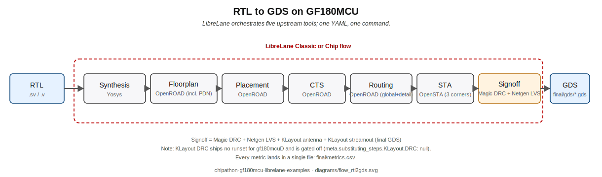
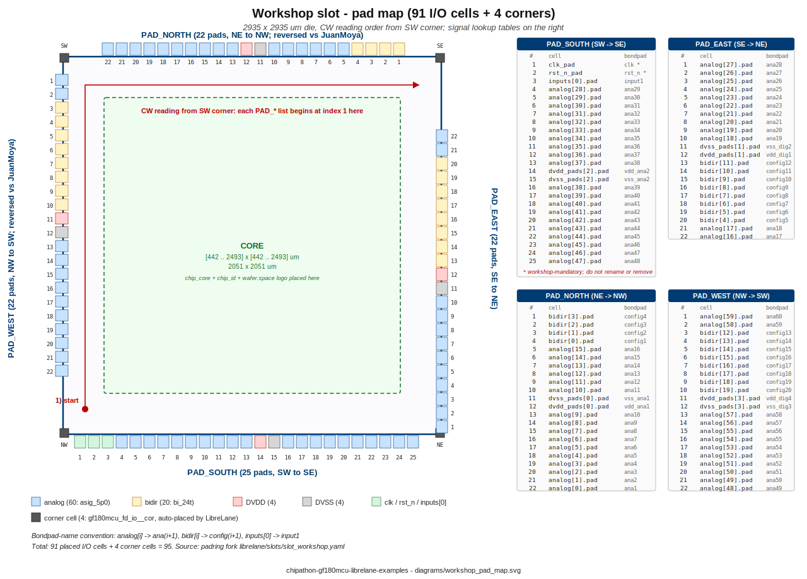
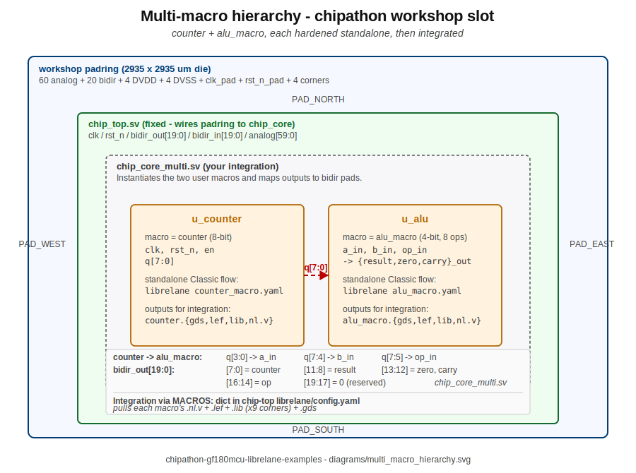

# Reading order

Pick one of these two paths through the repository depending on what
you want.

## Path A - "I want to tape out by the end of the afternoon"

1. Run `scripts/bootstrap_container.sh` once.
2. Open [`examples/03_rtl2gds_chipathon_use.ipynb`](../examples/03_rtl2gds_chipathon_use.ipynb).
3. Flip `RUN_CLONE_FORK`, `RUN_CLONE_PDK`, `RUN_WRITE_CORE`, `RUN_FLOW`
   to `True` in Step 0, one at a time, running cells top to bottom.
4. Edit the `CHIP_CORE_USER` string in Step 2 to be your own RTL.
5. Wait ~35-45 min for Step 4 to finish.
6. Your GDS is at
   `~/eda/designs/chipathon_padring/template/final/gds/chip_top.gds`.

That is the entire flow. You skipped reading about slots, macros, the
PDN. Come back later when you want to understand what the notebook
did, starting from notebook 00.

## Path B - "I want to understand the flow end to end"

Read the notebooks in order. Each takes 10-30 min to go through.

### 00 - `00_slots_explained.ipynb`

Start here. Purely conceptual. You will learn:

- What a *slot* is, and why it is a wafer-space convention, not a
  LibreLane or GF180 one.
- The three files that define one slot:
  `src/slot_defines.svh` + `librelane/slots/slot_<name>.yaml` +
  `Makefile`.
- The pad-list-clockwise-from-SW rule that shapes every `PAD_*` list.
- A side-by-side pad table for all five slots.

No flow runs. You will auto-clone the chipathon-2026 padring fork
the first time the parser cell executes.

### 01 - `01_rtl2gds_counter.ipynb`

Smallest end-to-end flow. A 4-bit counter, no padring, no SRAM, no
slots. Purpose: you learn the Docker + LibreLane Classic mechanics
in ~2 minutes of wall time, and you confirm your host is set up
correctly before sinking 35-45 minutes into a chip-top run.

Self-contained: the RTL and the LibreLane `config.yaml` are both
inlined as Python strings inside the notebook. No repo clone needed.

### 02 - `02_rtl2gds_chip_top_custom.ipynb`

Full-chip flow on the **upstream** wafer-space template's `slot_1x1`,
with the notebook-01 counter hardened as a macro replacing one of the
two SRAM512x8 blocks. You learn:

- How the chip-flow config declares macros (`MACROS:`, with
  `gds/lef/vh/lib/instances`).
- Manual per-macro placement coordinates.
- How to surgically patch `librelane/config.yaml` and
  `librelane/pdn_cfg.tcl` around a macro swap.

This notebook clones the stock upstream template, not the chipathon
fork.

### 03 - `03_rtl2gds_chipathon_use.ipynb`

Same flow as notebook 02, but targeting the **chipathon workshop
slot** (fork: `chipathon-2026-gf180mcu-padring`). Your RTL replaces
only `chip_core.sv`; the padring and the chip_id / logo macros are
inherited from the fork. This is the notebook you mostly live in
during the chipathon.

### 04 - `04_counter_alu_multimacro/`

Two macros, independently hardened, stitched together. You will
learn:

- Cocotb verification (counter: freeze/wrap, ALU: full truth table).
- Standalone Classic flow per macro (`librelane counter_macro.yaml`,
  `librelane alu_macro.yaml`), producing reusable GDS/LEF/lib/v
  views.
- Merging a multi-macro `MACROS:` dict into the padring fork's
  `librelane/config.yaml` at notebook runtime.
- `PDN_MACRO_CONNECTIONS` regex hookup.

## Where the diagrams live

All SVG sources sit under [`diagrams/`](../diagrams/). Corresponding
PNG renders are produced with `inkscape --export-type=png
--export-filename=X.png X.svg --export-width=1400` and regenerated
when the SVG changes.
